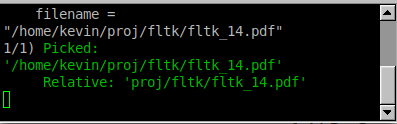

# fltk-widgets
A visual guide to the official FLTK 1.4 widgets and location within the `test` programs

|Widget|Picture|Tests|
|---|---|---|
|Fl_Adjuster.H||./fltk/test/adjuster.cxx, ./fltk/test/unittest_schemes.cxx, ./fltk/test/valuators.h, ./fltk/test/valuators2.cxx|
|Fl_Bitmap.H||./fltk/test/bitmap.cxx, ./fltk/test/device.cxx, ./fltk/test/sudoku.cxx|
|Fl_Box.H||./fltk/test/CubeView.h, ./fltk/test/CubeViewUI.h, ./fltk/test/adjuster.cxx, ./fltk/test/ask.cxx, ./fltk/test/boxtype.cxx, ./fltk/test/cairo_test.cxx, ./fltk/test/checkers.cxx, ./fltk/test/colbrowser.cxx, ./fltk/test/color_chooser.cxx, ./fltk/test/cube.cxx, ./fltk/test/cursor.cxx, ./fltk/test/demo.cxx, ./fltk/test/doublebuffer.cxx, ./fltk/test/fast_slow.h, ./fltk/test/fltk-versions.cxx, ./fltk/test/fonts.cxx, ./fltk/test/gl_overlay.cxx, ./fltk/test/hello.cxx, ./fltk/test/iconize.cxx, ./fltk/test/inactive.h, ./fltk/test/keyboard_ui.h, ./fltk/test/label.cxx, ./fltk/test/line_style.cxx, ./fltk/test/mandelbrot.h, ./fltk/test/mandelbrot_ui.h, ./fltk/test/menubar.cxx, ./fltk/test/minimum.cxx, ./fltk/test/native-filechooser.cxx, ./fltk/test/offscreen.cxx, ./fltk/test/output.cxx, ./fltk/test/pixmap_browser.cxx, ./fltk/test/preferences.h, ./fltk/test/resize-arrows.h, ./fltk/test/resize.h, ./fltk/test/resizebox.cxx, ./fltk/test/rotated_text.cxx, ./fltk/test/scroll.cxx, ./fltk/test/shape.cxx, ./fltk/test/subwindow.cxx, ./fltk/test/symbols.cxx, ./fltk/test/tabs.h, ./fltk/test/tile.cxx, ./fltk/test/tree.h, ./fltk/test/unittest_circles.cxx, ./fltk/test/unittest_lines.cxx, ./fltk/test/unittest_points.cxx, ./fltk/test/unittest_rects.cxx, ./fltk/test/unittest_schemes.cxx, ./fltk/test/unittest_symbol.cxx, ./fltk/test/unittest_text.cxx, ./fltk/test/unittest_viewport.cxx, ./fltk/test/unittests.cxx, ./fltk/test/utf8.cxx, ./fltk/test/valuators.h, ./fltk/test/valuators2.cxx, ./fltk/test/windowfocus.cxx|
|Fl_Browser.H||./fltk/test/fullscreen.cxx, ./fltk/test/unittest_scrollbarsize.cxx|
|Fl_Button.H||./fltk/test/animated.cxx, ./fltk/test/ask.cxx, ./fltk/test/bitmap.cxx, ./fltk/test/blocks.cxx, ./fltk/test/browser.cxx, ./fltk/test/button.cxx, ./fltk/test/buttons.cxx, ./fltk/test/colbrowser.cxx, ./fltk/test/color_chooser.cxx, ./fltk/test/cube.cxx, ./fltk/test/demo.cxx, ./fltk/test/editor.cxx, ./fltk/test/fonts.cxx, ./fltk/test/fractals.cxx, ./fltk/test/handle_events.cxx, ./fltk/test/iconize.cxx, ./fltk/test/image.cxx, ./fltk/test/inactive.h, ./fltk/test/input.cxx, ./fltk/test/input_choice.cxx, ./fltk/test/keyboard_ui.h, ./fltk/test/mandelbrot.cxx, ./fltk/test/native-filechooser.cxx, ./fltk/test/overlay.cxx, ./fltk/test/pack.cxx, ./fltk/test/pixmap.cxx, ./fltk/test/pixmap_browser.cxx, ./fltk/test/preferences.h, ./fltk/test/radio.h, ./fltk/test/resize-example3a.cxx, ./fltk/test/resize-example3b.cxx, ./fltk/test/resize-example3c.cxx, ./fltk/test/resize.h, ./fltk/test/sudoku.cxx, ./fltk/test/tabs.h, ./fltk/test/tiled_image.cxx, ./fltk/test/tree.h, ./fltk/test/twowin.cxx, ./fltk/test/unittest_images.cxx, ./fltk/test/unittest_schemes.cxx, ./fltk/test/utf8.cxx|
|Fl_Cairo_Window.H||./fltk/test/cairo_test.cxx|
|Fl_Check_Button.H||./fltk/test/buttons.cxx, ./fltk/test/inactive.h, ./fltk/test/line_style.cxx, ./fltk/test/preferences.h, ./fltk/test/radio.h, ./fltk/test/table.cxx, ./fltk/test/tree.h, ./fltk/test/unittest_images.cxx, ./fltk/test/unittest_schemes.cxx, ./fltk/test/utf8.cxx|
|Fl_Choice.H||./fltk/test/browser.cxx, ./fltk/test/cursor.cxx, ./fltk/test/demo.cxx, ./fltk/test/icon.cxx, ./fltk/test/label.cxx, ./fltk/test/line_style.cxx, ./fltk/test/menubar.cxx, ./fltk/test/preferences.h, ./fltk/test/rotated_text.cxx, ./fltk/test/scroll.cxx, ./fltk/test/table.cxx, ./fltk/test/tree.h, ./fltk/test/unittest_schemes.cxx, ./fltk/test/utf8.cxx|
|Fl_Clock.H||./fltk/test/clock.cxx, ./fltk/test/device.cxx, ./fltk/test/inactive.h, ./fltk/test/tabs.h, ./fltk/test/unittest_schemes.cxx|
|Fl_Color_Chooser.H||./fltk/test/color_chooser.cxx, ./fltk/test/input.cxx, ./fltk/test/tree.h|
|Fl_Copy_Surface.H||./fltk/test/device.cxx|
|Fl_Counter.H||./fltk/test/unittest_schemes.cxx, ./fltk/test/valuators.h, ./fltk/test/valuators2.cxx|
|Fl_Dial.H||./fltk/test/inactive.h, ./fltk/test/keyboard_ui.h, ./fltk/test/valuators.h, ./fltk/test/valuators2.cxx|
|Fl_Double_Window.H||./fltk/test/CubeViewUI.h, ./fltk/test/adjuster.cxx, ./fltk/test/animated.cxx, ./fltk/test/arc.cxx, ./fltk/test/ask.cxx, ./fltk/test/bitmap.cxx, ./fltk/test/blocks.cxx, ./fltk/test/boxtype.cxx, ./fltk/test/browser.cxx, ./fltk/test/checkers.cxx, ./fltk/test/clock.cxx, ./fltk/test/colbrowser.cxx, ./fltk/test/cursor.cxx, ./fltk/test/curve.cxx, ./fltk/test/demo.cxx, ./fltk/test/doublebuffer.cxx, ./fltk/test/editor.cxx, ./fltk/test/fast_slow.h, ./fltk/test/file_chooser.cxx, ./fltk/test/fonts.cxx, ./fltk/test/handle_events.cxx, ./fltk/test/icon.cxx, ./fltk/test/image.cxx, ./fltk/test/inactive.h, ./fltk/test/input_choice.cxx, ./fltk/test/label.cxx, ./fltk/test/line_style.cxx, ./fltk/test/mandelbrot.h, ./fltk/test/menubar.cxx, ./fltk/test/minimum.cxx, ./fltk/test/offscreen.cxx, ./fltk/test/output.cxx, ./fltk/test/pack.cxx, ./fltk/test/pixmap.cxx, ./fltk/test/pixmap_browser.cxx, ./fltk/test/preferences.h, ./fltk/test/radio.h, ./fltk/test/resize-example1.cxx, ./fltk/test/resize-example2.cxx, ./fltk/test/resize-example3a.cxx, ./fltk/test/resize-example3b.cxx, ./fltk/test/resize-example3c.cxx, ./fltk/test/resize-example4a.cxx, ./fltk/test/resize-example4b.cxx, ./fltk/test/resize.h, ./fltk/test/resizebox.cxx, ./fltk/test/rotated_text.cxx, ./fltk/test/scroll.cxx, ./fltk/test/sudoku.cxx, ./fltk/test/symbols.cxx, ./fltk/test/tabs.h, ./fltk/test/tile.cxx, ./fltk/test/tiled_image.cxx, ./fltk/test/tree.h, ./fltk/test/twowin.cxx, ./fltk/test/unittests.cxx, ./fltk/test/utf8.cxx, ./fltk/test/valuators.h, ./fltk/test/valuators2.cxx, ./fltk/test/windowfocus.cxx|
|Fl_File_Chooser.H||./fltk/test/file_chooser.cxx, ./fltk/test/fonts.cxx, ./fltk/test/pixmap_browser.cxx, ./fltk/test/tree.h|
|Fl_File_Icon.H||./fltk/test/file_chooser.cxx|
|Fl_File_Input.H||./fltk/test/unittest_schemes.cxx|
|Fl_Fill_Dial.H||./fltk/test/valuators2.cxx|
|Fl_Fill_Slider.H||./fltk/test/valuators2.cxx|
|Fl_Float_Input.H||./fltk/test/input.cxx, ./fltk/test/mandelbrot_ui.h|
|Fl_Gl_Window.H||./fltk/test/CubeView.h, ./fltk/test/cube.cxx, ./fltk/test/fullscreen.cxx, ./fltk/test/gl_overlay.cxx, ./fltk/test/handle_events.cxx, ./fltk/test/shape.cxx|
|Fl_Group.H||./fltk/test/CubeViewUI.h, ./fltk/test/editor.cxx, ./fltk/test/fractals.cxx, ./fltk/test/inactive.h, ./fltk/test/preferences.h, ./fltk/test/radio.h, ./fltk/test/sudoku.cxx, ./fltk/test/tabs.h, ./fltk/test/tree.h, ./fltk/test/tree.h, ./fltk/test/unittest_images.cxx, ./fltk/test/unittest_schemes.cxx, ./fltk/test/unittest_scrollbarsize.cxx, ./fltk/test/unittest_simple_terminal.cxx, ./fltk/test/unittests.cxx|
|Fl_Help_Dialog.H||./fltk/test/help_dialog.cxx, ./fltk/test/sudoku.cxx|
|Fl_Help_View.H||./fltk/test/native-filechooser.cxx, ./fltk/test/unittest_about.cxx, ./fltk/test/unittests.cxx|
|Fl_Hold_Browser.H||./fltk/test/colbrowser.cxx, ./fltk/test/fonts.cxx, ./fltk/test/unittests.cxx, ./fltk/test/utf8.cxx|
|Fl_Hor_Fill_Slider.H||./fltk/test/valuators2.cxx|
|Fl_Hor_Nice_Slider.H||./fltk/test/valuators2.cxx|
|Fl_Hor_Slider.H||./fltk/test/doublebuffer.cxx, ./fltk/test/fullscreen.cxx, ./fltk/test/gl_overlay.cxx, ./fltk/test/shape.cxx, ./fltk/test/valuators2.cxx|
|Fl_Hor_Value_Slider.H||./fltk/test/arc.cxx, ./fltk/test/cursor.cxx, ./fltk/test/curve.cxx, ./fltk/test/label.cxx, ./fltk/test/output.cxx, ./fltk/test/rotated_text.cxx|
|Fl_Image.H||./fltk/test/animated.cxx, ./fltk/test/color_chooser.cxx, ./fltk/test/image.cxx|
|Fl_Image_Surface.H||./fltk/test/device.cxx, ./fltk/test/sudoku.cxx|
|Fl_Input.H||./fltk/test/ask.cxx, ./fltk/test/editor.cxx, ./fltk/test/fullscreen.cxx, ./fltk/test/inactive.h, ./fltk/test/input.cxx, ./fltk/test/label.cxx, ./fltk/test/mandelbrot.h, ./fltk/test/native-filechooser.cxx, ./fltk/test/navigation.cxx, ./fltk/test/output.cxx, ./fltk/test/preferences.h, ./fltk/test/rotated_text.cxx, ./fltk/test/subwindow.cxx, ./fltk/test/table.cxx, ./fltk/test/tabs.h, ./fltk/test/twowin.cxx, ./fltk/test/unittest_schemes.cxx, ./fltk/test/utf8.cxx, ./fltk/test/windowfocus.cxx|
|Fl_Input_Choice.H||./fltk/test/input_choice.cxx|
|Fl_Int_Input.H||./fltk/test/browser.cxx, ./fltk/test/input.cxx, ./fltk/test/preferences.h|
|Fl_Light_Button.H||./fltk/test/buttons.cxx, ./fltk/test/device.cxx, ./fltk/test/file_chooser.cxx, ./fltk/test/inactive.h, ./fltk/test/input.cxx, ./fltk/test/navigation.cxx, ./fltk/test/pack.cxx, ./fltk/test/radio.h, ./fltk/test/scroll.cxx, ./fltk/test/tree.h, ./fltk/test/unittest_schemes.cxx|
|Fl_Line_Dial.H||./fltk/test/valuators2.cxx|
|Fl_Menu_Bar.H||./fltk/test/editor.cxx|
|Fl_Menu_Button.H||./fltk/test/demo.cxx, ./fltk/test/fullscreen.cxx, ./fltk/test/inactive.h, ./fltk/test/menubar.cxx, ./fltk/test/subwindow.cxx|
|Fl_Menu_Item.H||./fltk/test/checkers.cxx|
|Fl_Multi_Label.H||./fltk/test/pixmap.cxx|
|Fl_Multiline_Input.H||./fltk/test/input.cxx, ./fltk/test/native-filechooser.cxx|
|Fl_Multiline_Output.H||./fltk/test/output.cxx|
|Fl_Native_File_Chooser.H||./fltk/test/device.cxx, ./fltk/test/editor.cxx, ./fltk/test/native-filechooser.cxx, ./fltk/test/pixmap_browser.cxx|
|Fl_Nice_Slider.H||./fltk/test/valuators2.cxx|
|Fl_Output.H||./fltk/test/keyboard_ui.h, ./fltk/test/output.cxx, ./fltk/test/radio.h, ./fltk/test/unittest_schemes.cxx, ./fltk/test/utf8.cxx|
|Fl_Overlay_Window.H||./fltk/test/device.cxx, ./fltk/test/overlay.cxx|
|Fl_PNG_Image.H||./fltk/test/checkers.cxx|
|Fl_PNM_Image.H||./fltk/test/file_chooser.cxx|
|Fl_Pack.H||./fltk/test/pack.cxx|
|Fl_Pixmap.H||./fltk/test/device.cxx, ./fltk/test/label.cxx, ./fltk/test/pixmap.cxx, ./fltk/test/tiled_image.cxx, ./fltk/test/tree.h|
|Fl_PostScript.H||./fltk/test/device.cxx|
|Fl_Preferences.H||./fltk/test/blocks.cxx, ./fltk/test/preferences.h, ./fltk/test/sudoku.cxx, ./fltk/test/tree.h|
|Fl_Printer.H||./fltk/test/cube.cxx, ./fltk/test/device.cxx, ./fltk/test/mandelbrot.cxx, ./fltk/test/pixmap_browser.cxx|
|Fl_Progress.H||./fltk/test/unittest_schemes.cxx|
|Fl_RGB_Image.H||./fltk/test/icon.cxx|
|Fl_Radio_Button.H||./fltk/test/resizebox.cxx, ./fltk/test/unittest_images.cxx|
|Fl_Radio_Light_Button.H||./fltk/test/cube.cxx|
|Fl_Radio_Round_Button.H||./fltk/test/device.cxx, ./fltk/test/unittest_schemes.cxx|
|Fl_Repeat_Button.H||./fltk/test/buttons.cxx|
|Fl_Return_Button.H||./fltk/test/ask.cxx, ./fltk/test/buttons.cxx, ./fltk/test/editor.cxx, ./fltk/test/minimum.cxx, ./fltk/test/radio.h, ./fltk/test/tabs.h|
|Fl_Roller.H||./fltk/test/CubeViewUI.h, ./fltk/test/inactive.h, ./fltk/test/unittest_schemes.cxx, ./fltk/test/valuators.h, ./fltk/test/valuators2.cxx|
|Fl_Round_Button.H||./fltk/test/buttons.cxx, ./fltk/test/device.cxx, ./fltk/test/inactive.h, ./fltk/test/preferences.h, ./fltk/test/radio.h|
|Fl_Round_Clock.H||./fltk/test/clock.cxx|
|Fl_SVG_File_Surface.H||./fltk/test/device.cxx, ./fltk/test/pixmap_browser.cxx|
|Fl_Scroll.H||./fltk/test/pack.cxx, ./fltk/test/scroll.cxx, ./fltk/test/utf8.cxx|
|Fl_Scrollbar.H||./fltk/test/inactive.h, ./fltk/test/unittest_schemes.cxx, ./fltk/test/valuators.h, ./fltk/test/valuators2.cxx|
|Fl_Secret_Input.H||./fltk/test/input.cxx|
|Fl_Select_Browser.H||./fltk/test/browser.cxx|
|Fl_Shared_Image.H||./fltk/test/file_chooser.cxx, ./fltk/test/pixmap_browser.cxx, ./fltk/test/unittests.cxx|
|Fl_Simple_Counter.H||./fltk/test/valuators2.cxx|
|Fl_Simple_Terminal.H||./fltk/test/browser.cxx, ./fltk/test/demo.cxx, ./fltk/test/file_chooser.cxx, ./fltk/test/input.cxx, ./fltk/test/input_choice.cxx, ./fltk/test/menubar.cxx, ./fltk/test/native-filechooser.cxx, ./fltk/test/table.cxx, ./fltk/test/tree.h, ./fltk/test/unittest_simple_terminal.cxx, ./fltk/test/valuators.h, ./fltk/test/valuators2.cxx|
|Fl_Single_Window.H||./fltk/test/doublebuffer.cxx, ./fltk/test/fullscreen.cxx|
|Fl_Slider.H||./fltk/test/CubeViewUI.h, ./fltk/test/checkers.cxx, ./fltk/test/cube.cxx, ./fltk/test/fast_slow.h, ./fltk/test/inactive.h, ./fltk/test/mandelbrot.h, ./fltk/test/mandelbrot_ui.h, ./fltk/test/minimum.cxx, ./fltk/test/unittest_schemes.cxx, ./fltk/test/valuators.h, ./fltk/test/valuators2.cxx|
|Fl_Spinner.H||./fltk/test/valuators.h, ./fltk/test/valuators2.cxx|
|Fl_Sys_Menu_Bar.H||./fltk/test/cube.cxx, ./fltk/test/menubar.cxx, ./fltk/test/sudoku.cxx|
|Fl_Table.H||./fltk/test/unittest_scrollbarsize.cxx|
|Fl_Table_Row.H||./fltk/test/table.cxx|
|Fl_Tabs.H||./fltk/test/tabs.h, ./fltk/test/unittest_schemes.cxx|
|Fl_Text_Buffer.H||./fltk/test/editor.cxx|
|Fl_Text_Display.H||./fltk/test/tree.h, ./fltk/test/unittest_schemes.cxx, ./fltk/test/unittest_scrollbarsize.cxx|
|Fl_Text_Editor.H||./fltk/test/editor.cxx, ./fltk/test/unittest_schemes.cxx|
|Fl_Tile.H||./fltk/test/fonts.cxx, ./fltk/test/tile.cxx, ./fltk/test/utf8.cxx|
|Fl_Tiled_Image.H||./fltk/test/blocks.cxx, ./fltk/test/tiled_image.cxx|
|Fl_Toggle_Button.H||./fltk/test/bitmap.cxx, ./fltk/test/connect.cxx, ./fltk/test/curve.cxx, ./fltk/test/gl_overlay.cxx, ./fltk/test/image.cxx, ./fltk/test/input.cxx, ./fltk/test/label.cxx, ./fltk/test/menubar.cxx, ./fltk/test/output.cxx, ./fltk/test/pixmap.cxx, ./fltk/test/rotated_text.cxx, ./fltk/test/subwindow.cxx|
|Fl_Toggle_Light_Button.H||./fltk/test/fullscreen.cxx|
|Fl_Tooltip.H||./fltk/test/buttons.cxx, ./fltk/test/tree.h|
|Fl_Tree.H||./fltk/test/tree.h, ./fltk/test/unittest_scrollbarsize.cxx|
|Fl_Value_Input.H||./fltk/test/output.cxx, ./fltk/test/unittest_schemes.cxx, ./fltk/test/valuators.h, ./fltk/test/valuators2.cxx|
|Fl_Value_Output.H||./fltk/test/checkers.cxx, ./fltk/test/inactive.h, ./fltk/test/unittest_schemes.cxx, ./fltk/test/utf8.cxx, ./fltk/test/valuators.h, ./fltk/test/valuators2.cxx|
|Fl_Value_Slider.H||./fltk/test/CubeViewUI.h, ./fltk/test/colbrowser.cxx, ./fltk/test/line_style.cxx, ./fltk/test/menubar.cxx, ./fltk/test/pack.cxx, ./fltk/test/preferences.h, ./fltk/test/symbols.cxx, ./fltk/test/tree.h, ./fltk/test/unittest_schemes.cxx, ./fltk/test/unittest_scrollbarsize.cxx, ./fltk/test/valuators.h, ./fltk/test/valuators2.cxx|
|Fl_Window.H||./fltk/test/button.cxx, ./fltk/test/buttons.cxx, ./fltk/test/color_chooser.cxx, ./fltk/test/connect.cxx, ./fltk/test/cube.cxx, ./fltk/test/fltk-versions.cxx, ./fltk/test/fractals.cxx, ./fltk/test/gl_overlay.cxx, ./fltk/test/hello.cxx, ./fltk/test/iconize.cxx, ./fltk/test/input.cxx, ./fltk/test/mandelbrot_ui.h, ./fltk/test/message.cxx, ./fltk/test/native-filechooser.cxx, ./fltk/test/navigation.cxx, ./fltk/test/overlay.cxx, ./fltk/test/shape.cxx, ./fltk/test/subwindow.cxx, ./fltk/test/table.cxx|
|Fl_Wizard.H||./fltk/test/tabs.h|
|Fl_XBM_Image.H||./fltk/test/blocks.cxx|
|Fl_XPM_Image.H||./fltk/test/blocks.cxx|
|fl_ask.H||./fltk/test/ask.cxx, ./fltk/test/browser.cxx, ./fltk/test/button.cxx, ./fltk/test/cairo_test.cxx, ./fltk/test/checkers.cxx, ./fltk/test/colbrowser.cxx, ./fltk/test/demo.cxx, ./fltk/test/editor.cxx, ./fltk/test/fltk-versions.cxx, ./fltk/test/fonts.cxx, ./fltk/test/fullscreen.cxx, ./fltk/test/menubar.cxx, ./fltk/test/message.cxx, ./fltk/test/native-filechooser.cxx, ./fltk/test/preferences.cxx, ./fltk/test/sudoku.cxx, ./fltk/test/table.cxx, ./fltk/test/tabs.h, ./fltk/test/tree.h|
|fl_draw.H||./fltk/test/animated.cxx, ./fltk/test/arc.cxx, ./fltk/test/blocks.cxx, ./fltk/test/boxtype.cxx, ./fltk/test/cairo_test.cxx, ./fltk/test/checkers.cxx, ./fltk/test/color_chooser.cxx, ./fltk/test/cursor.cxx, ./fltk/test/curve.cxx, ./fltk/test/device.cxx, ./fltk/test/doublebuffer.cxx, ./fltk/test/fonts.cxx, ./fltk/test/fullscreen.cxx, ./fltk/test/label.cxx, ./fltk/test/line_style.cxx, ./fltk/test/mandelbrot.cxx, ./fltk/test/menubar.cxx, ./fltk/test/offscreen.cxx, ./fltk/test/output.cxx, ./fltk/test/overlay.cxx, ./fltk/test/resize-arrows.cxx, ./fltk/test/resizebox.cxx, ./fltk/test/rotated_text.cxx, ./fltk/test/scroll.cxx, ./fltk/test/subwindow.cxx, ./fltk/test/sudoku.cxx, ./fltk/test/symbols.cxx, ./fltk/test/table.cxx, ./fltk/test/unittest_circles.cxx, ./fltk/test/unittest_images.cxx, ./fltk/test/unittest_lines.cxx, ./fltk/test/unittest_points.cxx, ./fltk/test/unittest_rects.cxx, ./fltk/test/unittest_symbol.cxx, ./fltk/test/unittest_text.cxx, ./fltk/test/unittest_viewport.cxx, ./fltk/test/unittests.cxx, ./fltk/test/utf8.cxx|
|fl_message.H||./fltk/test/fractals.cxx, ./fltk/test/glpuzzle.cxx, ./fltk/test/pixmap_browser.cxx, ./fltk/test/resizebox.cxx, ./fltk/test/tree.h|
|fl_show_colormap.H||./fltk/test/color_chooser.cxx|
|fl_string.h||./fltk/test/menubar.cxx, ./fltk/test/unittests.cxx, ./fltk/test/utf8.cxx|
|fl_utf8.h||./fltk/test/demo.cxx, ./fltk/test/utf8.cxx|
