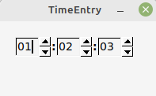
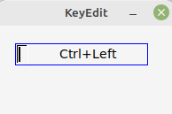
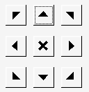
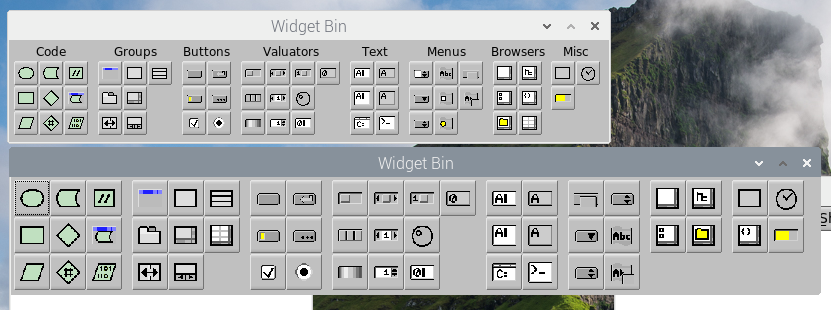

# FLTK Resources

My attempt to document widgets and other resources for use with the Fast Light Toolkit (FLTK).


## Widgets

FLTK Widgets which I've created.

- Last Used / Most Recently Used menu
- [Time Entry](#TimeEntry) : enter a length of time
- [KeyEdit](#KeyEdit) : enter a key chord/shortcut
- Show Dialog

## FLTK Hacks

- [Resizable Borderless Windows](#ResizeBorderless) : make FLTK border-less windows re-sizable on X11
- [Rotated '@' Labels](#RotateAtLabel) : additional '@' labels provided via rotation
- [Large button FLUID](#LargeFLUID) : larger buttons in the widget panel
- Transparent Widgets
- Color Theming

## FLTK Links

- [FLTK Site](fltk.org)
- [Erco's FLTK Cheat Page](https://www.seriss.com/people/erco/fltk/)
- Visual guide to FLTK widgets and examples

### Background

I've been using FLTK 1.4 releases on Linux Mint and Raspberry Pi. No testing on other platforms.

## Widgets

<A Name="TimeEntry"></A>
### TimeEntry Widget

A widget for entering a length of time, in Hours:Minutes:Seconds. Allows fetching the value in seconds or separate integers.



1. **TODO**: link to directory
1. **TODO**: zip containing files
1. **TODO**: areas for improvement

<A Name="KeyEdit"></A>
### KeyEdit Widget

A widget for entering keyboard chords / shortcuts. Entering keystrokes in the widget are shown as shortcut text (as might be used in a menu).

A screenshot, with the widget initialized to the `CTRL+Left-Arrow chord`.



1. **TODO**: link to directory
1. **TODO**: zip containing files
1. **TODO**: areas for improvement (Shift ignored, ...)


## Hacks

<A Name="RotateAtLabel"></A>
### Rotated '@' Labels

It wasn't obvious to me from the documentation, but the built-in '@' labels may be rotated to provide 
more variants. You can easily experiment using the `symbols` test program.

For example, here is a directional button matrix:



And the matching '@' labels used:

| --- | --- | --- |
| @3< | @2< | @1< |
| @<  | @1+ | @>  |
| @3> | @2> | @1> |

<A Name="ResizeBorderless"></A>
### A Resizable Borderless Window

Re-sizable, borderless windows are possible on an X11 windowing system, via a small tweak to the FLTK X11 driver code.

In `src/Fl_x.cxx`, there is a function `Fl_X11_Driver::sendxjunk`. Near the bottom of said function, there are these lines of code:
```
  if (!w->border()) {
    prop[0] |= 2; // MWM_HINTS_DECORATIONS
    prop[2] = 0; // no decorations
  }
```
By adding a single line of code, borderless windows are now re-sizable:
```
  if (!w->border()) {
    prop[0] |= 2; // MWM_HINTS_DECORATIONS
    prop[2] = 0; // no decorations
    prop[2] = 1 << 1 ; // KBR this gives me a resizable borderless window
  }
```
**NOTE**: this change makes _all_ borderless FLTK windows re-sizable. Making this a configurable option is left as an exercise for the reader.

This change has been observed to _not_ produce the desired behavior on KDE Plasma.

<A Name="LargeFLUID"></A>
### Large Button FLUID

I find the default size of the widget bin buttons in FLUID to be too small. Especially on newer, larger resolution monitors.

After reworking the panel creation code, the size of the buttons may now be modified by changing a single constant.

Here is a screen shot comparing the original versus modified:



The original, on top, has 24x24 buttons. The modified, below, has 36x36 buttons.

Missing: the text above the groups. The changed code needs some cleanup and comments.

1. **TODO**: link to directory
1. **TODO**: update to latest FLTK 1.4

### blah

You can use the [editor on GitHub](https://github.com/fire-eggs/fltk-widgets/edit/main/docs/index.md) to maintain and preview the content for your website in Markdown files.

Whenever you commit to this repository, GitHub Pages will run [Jekyll](https://jekyllrb.com/) to rebuild the pages in your site, from the content in your Markdown files.


### Markdown

Markdown is a lightweight and easy-to-use syntax for styling your writing. It includes conventions for

```markdown
Syntax highlighted code block

# Header 1
## Header 2
### Header 3

- Bulleted
- List

1. Numbered
2. List

**Bold** and _Italic_ and `Code` text

[Link](url) and 
```

For more details see [Basic writing and formatting syntax](https://docs.github.com/en/github/writing-on-github/getting-started-with-writing-and-formatting-on-github/basic-writing-and-formatting-syntax).

### Jekyll Themes

Your Pages site will use the layout and styles from the Jekyll theme you have selected in your [repository settings](https://github.com/fire-eggs/fltk-widgets/settings/pages). The name of this theme is saved in the Jekyll `_config.yml` configuration file.

### Support or Contact

Having trouble with Pages? Check out our [documentation](https://docs.github.com/categories/github-pages-basics/) or [contact support](https://support.github.com/contact) and we’ll help you sort it out.
